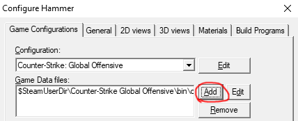
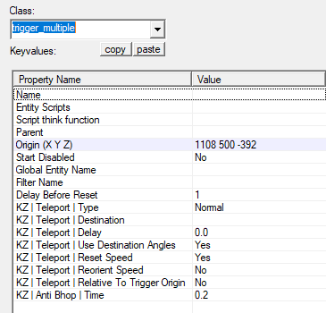
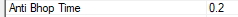

# Mapping

## Timer buttons

- Time starts when the player activates the start timer.
- Time ends when the player activates the end timer.
- Timer buttons **do** create virtual buttons (timer tech).

#### To implement timer buttons, the following are required:

- Create a [func_button](https://developer.valvesoftware.com/wiki/Func_button "Valve Developer Community Wiki reference") entity.
- Name the entity as either:
	- `climb_startbutton` for the **start** of the **main course**.
	- `climb_endbutton` for the **end** of the **main course**.
	- `climb_bonusX_startbutton` for the **start** of a **bonus course** where X is the bonus number.
	- `climb_bonusX_endbutton` for the **end** of a **bonus course** where X is the bonus number.
- Enable both the `Don't move` and `Toggle` flags to avoid usability issues.

---

## Timer zones

- Time starts when the player leaves the zone.
- Time ends when the player enters the zone.
- Timer zones **do not** create virtual buttons (timer tech).

#### To implement timer zones, the following are required:

- Create a [trigger_multiple](https://developer.valvesoftware.com/wiki/Trigger_multiple "Valve Developer Community Wiki reference") entity.
- Name the entity as either:
	- `climb_startzone` for the **start** of the **main course**.
	- `climb_endzone` for the **end** of the **main course**.
	- `climb_bonusX_startzone` for the **start** of a **bonus course** where X is the bonus number.
	- `climb_bonusX_endzone` for the **end** of a **bonus course** where X is the bonus number.

#### Things to keep in mind:

- Timer zones can act as [Course starts](#markdown-header-course-starts)
	- Entering a **start** timer zone will stop the player's current timer.
	- Entering a **start** timer zone will set the player's start position to the zone.
- Start zones can be left midair as long as a perfect bunnyhop is **not** hit.
- Multiple start timer zones should not be possible to be activated at once to avoid usability issues.

---

## Course starts

Course starts mark where players will be teleported when using the following commands:

- `!m` command to teleport to the **main course**.
- `!b <number>` command to teleport to the specified **bonus course**.

#### To implement course starts, the following are required:

- Create an [info_teleport_destination](https://developer.valvesoftware.com/wiki/Info_teleport_destination "Valve Developer Wiki reference") entity.
- Name the entity as either:
	- `climb_start` for the **main course**.
	- `climb_bonusX_start` for a **bonus course** where X is the bonus number.
- Set `Pitch Yaw Roll (Y Z X)` to the angles you wish to teleport the player into.

---

## Mapping API FGD

For the following features you will need the [kz_mapping_api.fgd](https://bitbucket.org/kztimerglobalteam/gokz/raw/master/kz_mapping_api.fgd) file.

**IMPORTANT:** None of the features work without the gokz-core plugin.

After opening the above link for the .fgd, right click on the page and click `Save As` and save it to somewhere safe. Make sure the file extension is `.fgd` and not `.fgd.txt`, otherwise hammer won't be able to open it.

In hammer, open options and click on the `Add` button and locate your `kz_mapping_api.fgd` file:

If you installed it successfully, then you should see a `KZ | Mapping API Version` parameter at the bottom of the Map Properties window.

## Updating

When the fgd changes with a Mapping API update and you update the fgd, then you have to change the `KZ | Mapping API Version` parameter in hammer on every map you've used it on to the correct version (written at the top of the fgd)!

**IMPORTANT:** It should ALWAYS be just a number, like this: "2", not something like this: "V2", "v 2", etc.

---

## Teleport Triggers

All the parameters are also well explained inside hammer.

- Create a [trigger_multiple](https://developer.valvesoftware.com/wiki/trigger_multiple "Valve Developer Wiki reference") entity.
- Name the entity as
	- `climb_teleport`
- Set `KZ | Teleport | Destination` to the entity you want to teleport the player to.
- Optionally change `KZ | Teleport | Delay` - This makes it so the player gets teleported to the destination only after they've been in the trigger this long.
- Optionally change `KZ | Teleport | Use Destination Angles` from the default `Yes` if you don't want players to get their angles changed to the destination entity's.
- Optionally change `KZ | Teleport | Reset Speed` from the default `Yes` if you want players to keep their speed when you get teleported.
- Optionally change `KZ | Teleport | Reorient Player` - When teleported, it rotates the player's velocity and yaw by the teleport destination's yaw angle. The pitch angle will remain unchanged. This overrides the value of 'Use Destination Angles'.
- Optionally change `KZ | Teleport | Relative To Trigger Origin` - Gets the offset of the player to this trigger, then teleports the player to the destination with that offset added. If `Reorient Player` is enabled, then the offset is rotated by the destination entity's yaw. Changing the destination yaw will cause visible lag when moving your mouse.

### Bhop triggers

Bhop triggers share the same setup with teleport triggers just above, with a few extra steps.

#### To implement bhop triggers, the following are required:

- Change the `KZ | Teleport | Type` parameter to one of the following:
	- `Multi Bhop`
	- `Single Bhop`
	- `Sequential Bhop`
- Change `KZ | Teleport | Delay` - **IMPORTANT:** The teleport delay for bhops starts when you touch the ground inside the trigger, instead of when you touch the trigger. 0.1 is a very common value. The minimum delay is 0.08 for bhop triggers. Read more below:

#### Important information

- The reason that the minimum delay is so high is that a very small delay will greatly increase the chances of getting a false bhop hack ban.
- For single bhops, you get teleported if you bhop on the same single bhop trigger twice.
- For sequential bhops, you get teleported if you bhop on any of the sequential bhop triggers that you've already bhopped on.
- Single and sequential bhops get automatically reset if you touch the ground or a ladder without touching any single/sequential bhop triggers (touching multibhop triggers will automatically reset as well).
- Single bhops also get reset when you touch a bhop trigger that isn't a single bhop.

If you need to reset bhop triggers manually, then you can use the `climb_bhop_reset` trigger.

**IMPORTANT:** You will almost never need to use `climb_bhop_reset` because resetting happens automatically.

#### To implement a bhop reset trigger, the following is required:

- Create a [trigger_multiple](https://developer.valvesoftware.com/wiki/trigger_multiple "Valve Developer Wiki reference") entity.
- Name the entity as `climb_bhop_reset`

---

## Other triggers

### climb_anti_pause

- Disables pausing while in the trigger. Only works when the timer is running.

#### To implement this, the following is required:

- Create a [trigger_multiple](https://developer.valvesoftware.com/wiki/trigger_multiple "Valve Developer Wiki reference") entity.
- Name the entity as `climb_anti_pause`

### climb_anti_checkpoint

- Disables checkpoints while in the trigger. Only works when the timer is running.

#### To implement this, the following is required:

- Create a [trigger_multiple](https://developer.valvesoftware.com/wiki/trigger_multiple "Valve Developer Wiki reference") entity.
- Name the entity as `climb_anti_checkpoint`

### climb_anti_bhop

- Disables jumping while on the ground in the trigger.

#### To implement this, the following is required:

- Create a [trigger_multiple](https://developer.valvesoftware.com/wiki/trigger_multiple "Valve Developer Wiki reference") entity.
- Name the entity as `climb_anti_bhop`
- Optionally change `KZ | Anti Bhop | Time` - A delay of 0 means that jumping is always disabled in this trigger. The delay timer starts when you're on the ground inside the trigger.

### climb_anti_jumpstat

- Invalidates jumpstats that are done inside the trigger.

#### To implement this, the following is required:

- Create a [trigger_multiple](https://developer.valvesoftware.com/wiki/trigger_multiple "Valve Developer Wiki reference") entity.
- Name the entity as `climb_anti_jumpstat`
